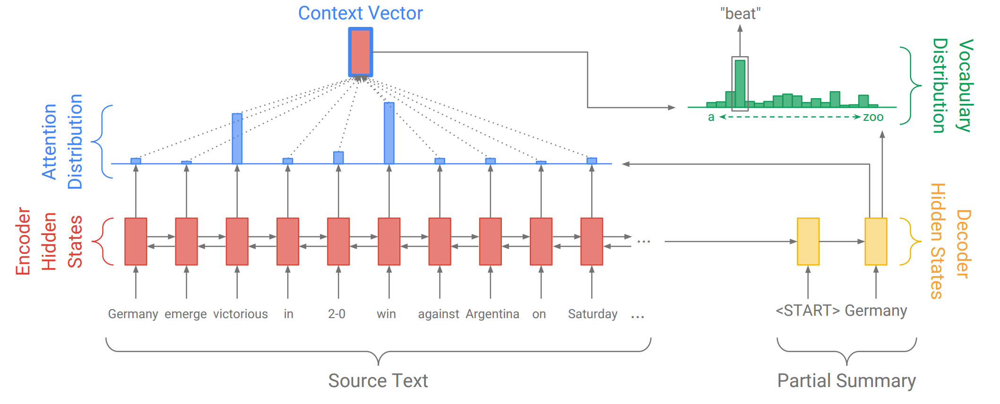

# Overview


Machine translation is a sub-field of computational linguistics that investigates the use of software to translate text or speech from one language to another. On a basic level, it performs simple substitution of words in one language for words in another, but that alone usually cannot produce a good translation of a text because recognition of whole phrases and their closest counterparts in the target language is needed. Solving this problem with corpus statistical, and neural techniques is a rapidly growing field that is leading to better translations, handling differences in linguistic typology, translation of idioms, and the isolation of anomalies.



A deep learning based approach to MT, Neural Machine Translation has made rapid progress in recent years. **Translator** is a Machine Translation Autoencoder built using Seq2Seq Recurrent Nets (LSTM, GRU) with Attention in PyTorch.

## Built With

- Python
- PyTorch

## Dataset

[ManyThings.org](http://www.manythings.org/anki/) or directly from [Tatoeba](https://tatoeba.org/eng) into `data/` directory for training and testing.

## Getting Started

Translation Frencg to English

```
pip install -r requirements.txt
```

Now you can open up a terminal and start training the model, tweak your model configuration however you like:

```
python train.py --epochs 20 --batch-size 64 --lr 0.001 --num-layers 2 --hidden-size 512
```

Once you're done training, run the evaluation script which will load the pretrained models you provide in the `models/[model_name]` directory:

```
python evaluate.py --num-tests 30 --model-name lstm_2_bi_sgd
```

Now you are all set up!

## Results


Translations from French to English

```
Input: elle est habituee a vivre seule .
Target: she is used to living alone .
Predicted: she is used to living alone . <EOS>

Input: je suis sur que tes intentions etaient bonnes .
Target: i m sure your intentions were good .
Predicted: i am sure your intentions were good . <EOS>

Input: nous sommes attaquees .
Target: we re under attack .
Predicted: we re starved . <EOS>

Input: je ne suis pas laide .
Target: i m not ugly .
Predicted: i m not angry . <EOS>

Input: nous sommes juste fatigues .
Target: we re just tired .
Predicted: we re just bored . <EOS>

Input: nous nous rapprochons .
Target: we re getting closer .
Predicted: we re deluding . <EOS>

Input: elle n a pas peur des serpents .
Target: she isn t afraid of snakes .
Predicted: she is not afraid of snakes . <EOS>

Input: c est deja un homme .
Target: he s already a man . 
Predicted: he is a man . <EOS>

Input: je me rejouis de vous avoir finalement rencontre .
Target: i m glad to finally meet you .
Predicted: i m glad to finally meet you . <EOS>

Input: je suis la pour te proteger .
Target: i m here to protect you .
Predicted: i m here to protect you . <EOS>

Input: il est toujours en train de se plaindre .
Target: he is constantly complaining .
Predicted: he is always dreaming . <EOS>
```

## References

- [Effective Approaches to Attention-based Neural Machine Translation](https://arxiv.org/abs/1508.04025)
- [Learning Phrase Representations using RNN Encoder-Decoder for Statistical Machine Translation](https://arxiv.org/abs/1406.1078)
- [Sequence to Sequence Learning with Neural Networks](https://arxiv.org/abs/1409.3215)


